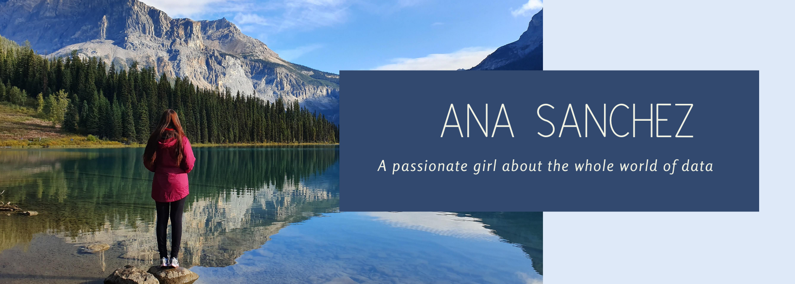
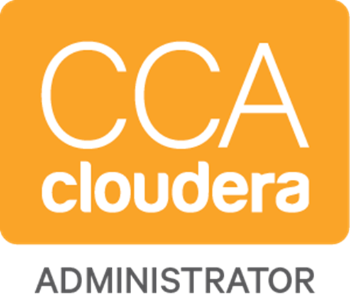

# Hi, welcome to my GitHub! 

I'm a Solutions Architect focused on Data and AI at <strong><a href="https://databricks.com/">Databricks</a></strong>. 

I've been working with technology since 2012, and during this time I worked with the most diverse types of projects like: gamming programming, web programming, network management systems, business Intelligence and big data (data engineering and architecture). 

What has enchanted me the most is working with data projects seen that today we have a huge amount of data everywhere and by using the right technologies, we can get answers to solve big problems, impacting all society and making the world a better place.

 

## 👩‍💻 About me
*  I'm from Brazil
*  Love Programming
*  My favorite programming language is Python
* 👩‍🏫 Love teaching and sharing knowledge
*  As a challenge enthusiastic, I am diving into the data science world
* 🏞️ Traveling is one of my favorite hobbies, as you can see from the image above, <a href="https://www.google.com/maps/place/51%C2%B026'25.4%22N+116%C2%B032'30.3%22W/@51.4403895,-116.5439459,17z/data=!4m5!3m4!1s0x0:0x0!8m2!3d51.4403895!4d-116.5417572">Emerald Lake</a> is one of the most beatiful places that I have ever been to
* <img width="20" src="data:image/png;base64,iVBORw0KGgoAAAANSUhEUgAAAOEAAADhCAMAAAAJbSJIAAABU1BMVEX///9CQkKvmZL5snT9xYChiH+NbmPdLAD/4LI4ODiampoAAAH7s3OsmJO3HBz9s3IwMDCrlIyznJXY2Nj9w3vf19XTx8QyMjI3NzcqKiqbhYD+3bc9PT3cIwC2m4+kioGHZVmIcWb7wYnZp4Lwr3jfqX+8nY18fHx5bmr9wnjy7+7/y4TIQSjNPCHQpIXJu7dTU1O5ubmDYFOYfHPHIxPorHzHoYn90p/R0dGsrKy5k3y1kX3+69b/37G0ABDlWzC6qKKoeE6LY0G/lWGCclvHrpv8y5eNjY1tbW3q5eTjxJ6Ke3ZpYV7SmW1aVVPU1NT+8eP+48Xvq6LlbFzfPB3yurLiVT/lZEXymV73083oaTvrlYvnfG3ASjXhRx/oi1e/e27tgU21i4JyUjUzJxrTl2IaFA1OOCXenmcrHhTdt4VkWEWolHY+NivOtZDny6iwg2htly9cAAANrklEQVR4nO2d63vTRhbGIynODbmynYuTrB0HcEjidIOTNHECpDUskLgJKVtCm9LdtizbLdt2gf//02okzcw5I8kY+wwe8+j9Qq2L0a9z5txmZMbGMmXKlClTpkyZMmXKlClTpkyZMmXKlOkT0L2/CN0b9rPo0NPxzTmhzblPj/He5jjS5t+H/UTUmhtXtDnsJyLW080Y4Sdmp58+4Vic8OmwH4lYLXUiPh72E1FL9aVzI+pLG43YoW+fPfuWHVXGkLnSxnP/XMKXaH/MvlXc3d2dKC7AJ2xcVpmePR87xoStsefPglOXCGihNOF/yd5HfvBe1didYFrdrS2IY99VJ5l8ku+vxre2Qjr/z6vv/UPhqe/ExfO13dVV9hW788N4/vdrPni6AHIiYvwhpIggX1xt+XBbW1cvJqvgxA/htQt7u+L+hfS/ZZhaEISMMRiGHyVIBOk4L6pVfPRHduX8BLz79nBJ0gQJfUur+RPsH4hlcvLyS1+X+Fj1mX9vaRfeOxqEga0phF98FugLlRANoMGE8wrhxG5bIfwskkJ4e1e50dR52FAfdOL650lDqA7iX6+r960a6kvH1Aftm3DX1KBfoyI0NeKP3VYnokIo5uFld8LV9rBJ0hSbiCphoi9NIDR1Go6N5d5D6CN++aUKmGClw+ZIlxoRr/8Ts1SrP/38809VJQ34XCE0NRoGgt6iVrRLv1Qh3uVL109Mt9yXCLL6S6lUrO0BQlM9KRP3NXtFO1D+UuBNMjxeW7gvQe69kg+uLUaQq6VhU3TVashXsiP9i4FEZQUsD7e2vLDAqFav3O0QsRQyGhsMQ7FBzAk+O59/8tXk5FeyNISQ41fBOcfx1kJEu5QzOVREmpgo2hLwVt11HGcujhcxOqG8/QjRLpo9C5nmIeBNLwBI5mPtKIcjrglEQ5NuoUYJAO6HgOmEfAx9xAOOaBs+hjZQYKE9Ejruirhv2Axd1S6CEeSAvRHKqdgeNkUXLQDANc/5EELHu8VvNXkqAsADCRhbWEtwNXAQ7aKxUxEMoQ1GpzdCxxMzsWhsYgrjhCsfPR0QmSlPbRjisElS1KkJwhIA7JXQqQvCmqkF4nyJJ9zb/RByMy3apgKOMcaQsO70QxhFfYP5mIJnXPH6IXRv5o12pKHacSPtnTCMF2aXh7eLYbTvizByNaOQ0+Bp2Duhkzc9p+lwV4qfu0vEx4QuD4edYZOkSVROmLC3vNSXJ75g2CQpus2TNhTvXddNJ/RPQkKetxmatjVEVooI7796dT8NkJ1z3DihoXballmpHMDX1wIlA/47OPerQHTFNxgZMjqgdNoWET8EvPafdMBr17jn9W6KxNQuGpjYyCEMEIOBce9HENcSDPVXfu5BeC0ENNHZgCFkiCtrbGTcV5zilavEjDn3AT/3GyOsr91CgOYNIhzCgPHAxYQ4LM45mBAUh4bOxEZRBfSwlbo4LPrnsJV6KqJpGfiCQsgDBvc0SuQPJt5v0Uk1VESEhuVu7WIRMvJWIo8Wr10XRX6WB7j1/8JoATpRjK9YNMxMb/sCU/EWDxduEPEd5wbT+PjfAo2PBx99I34AIr4HXE2bfZ9hZjoGlyxg+eR6N1rHU4F+5zPv9/DzceuGBy4E7UTDLJQLEILndlpTXA854R/iUAumpcbOQS5BCNrB7o2pqW6EU1M3JOGB6QtQkhB0SwHL1J+c8CE8Kofb+CU2SSgWZdwWZPmaE76BR1vCK+2PDmE9cQinpv4XRUd8VM7EkSEUNT6ahb7ehIR/4qOPxeUj42lK4pFbmCX0NX8oB1siIq6MDGHyNIwQH6rHPgrhzmmzub4z4Jd0Izx++2iF6VHJjv7j7bE4p5+wY5UrvsqFwRgT5iEnfJRXiyM7n390/LHGsFOuWKEK64N8TyrhcSnGFzDaxwphSRPhIge0rMXTAb5HRgtB+DhAWEniC8wZE0pfSlvgr09bUou9j2Kj0enMQi3E42FA+DZxBIML3wbRQmRAeS2Eh0sWVPmkC9Ps4c7MyfrphTVdWPJVQFq64EYmcpowHj5KA7TtR+y8yEzregjPK4jQKswkXDS7M7Pe9F1Rubw47fskK1GSUBZPXY00MlNOCLI2yobw7JL6oAri7NF6s1AoT6dxJRGK9UOXEUzkiqVSAl2pmJuAWZsr2omkPZqT6diTlk+jv6Czc9IsFxbfzxaqKQhF9RQ402DLaa7ImEohmv9HMcc2k6763vRYXCyaUaR7MRYTHrVSOJ2ZWT+32Mj1BhdKDI9Y5Q6cqdzgvBdJbnhGwULsiqJsB++UE5+1Mt2DVcZukjU+NzyHuZq76lZ8sBmcTcNYsLDbhITrH8yRrmlJKAtE3wwP0gnvgmkI9tNQLq4RAlqVZTERRZHPzPRr9VUaaaRvYLzXUuLPFigJz+KuJogXqUPIHI2IhrLrTRkOj5IcTd+EGzImyDXBVpeJuAc8KVwfJQwWlNPQqpwLQtDHqHcx0zfAz4BpSBksKAF9SULZbfNaqWbqG2lLDraYhnabDrARS2gGUkUYaf4W2Pc1NXUnmfAu7EKBbimhKz1MjoZ9Ey4LRBt0vR+nmKnvSWVZATvehI5mhtLRQGcK97E73rEw071cLide4lqV/Qs8DU11NNjVoM173EwZoK89bqTgEpl2k67+NkkBLeBq0AZM90ZophFghLj6Btgo3KpPOA0btEYK8za8e899HAxaTij4+BjtQpVGSjgNO5QZDROciHAvu+O+w4RsEN+hC9a0RENiV4omog3jheM+gUYaEj5BW9oOdERD2pwtFHj10EFCQxiYKTrt6ln/TajvBxSIiHijMDNTTPgOjTEwUsoezSlx0oaSb1hfhGaKCdOMlLSDQR4sQDcqbqZ7kHBPMVJxl92mJKR2pRZMTRUz9d5hQuxJ97XECuq8OyQ8SzVTTIiNdFtLykYfDi0cL/B27zomfI0IwU2EgPThMBCYiNib5hAhGl9gpKQ7vFM6iYMJxgtkpt4dSHgXEW7rmYY6Aj5u1uQRxs1lCbiMcjqwLZF2z+UMecBngvECFIm+KUJCeAaUhsSbn4mrw0gVQIjf8IKEqPIAG7zbpIT0KU1ACFoZK8gWa5Kwhk7I9Qri5e2mHkI4EeFQeXdTHI0sDanfJNHBZ+GJCB2Kuy0JofmCrJv6FWctjsaCEREVicCZIlcKsm7iDfoNDSkNUwVs+IbZN3CmyJXKNiLtopOepC0gPEtJa+qSsA7BgZHSOppvdBFCV7MNXYokTIkVxPto9KSlSvKN4oUMh4ltRPK3SLSkpUxNQAjjhSsCYg2OrK2NUEtaylSBhGAiyoAICPGLJKSAmtJSC/WFUeImCUHAR690Eb8mQ99piwTzNtjdTySEb8rYbVpCPYm3BXcs4IgoK8Q7gBAAUr/grCfxtnBAhBVUIiGsnKi3lepJvC0cENF69524lcKklPy9UV2ACqFsZSQSbmsk1JTSKCEfuJokQuRoqAk1dEsjXUDCfHcrhZtPqX9nQB9hExGKrCYx4uf1EeoqnmKEwpmCIl8Q1jUSkm5p60Yod/GJvFTUFsiVUqelukoLJkQo87Z4feje1EiorbSwwGZhFC7q8Rof/9DAqJQWCqHo1cAuBrdc2KMhJ9RWWqiEPCC627IlzNM2rYQn2nIahbDEacDSDA+IsMAnJ9SWeFvY09g2H8McEA8gKxoJtSXeSrQQ2xTrCSszCuFIdLwTCHlgAIS5qAenk1BjSoPzUj6GcNlC5G0KIWnmrTGlUQgjTwONVJip4mloX8rTF/Bx9RTFQ28bEUbxQokWpDW+xoCPKmCe07i1HFZSTkPap9EYDlGfJsq83TU8hFFag7uldpuSUGOwUAjriUPIQyIiJO2XanQ0qF8aJm2xIfQHMQgYiqshBNRZO03Dh46Kp9gIRiWUvvJJW8ObKWakeLcQV5icIkLCcKExKUXhMPCkXtxGQ2fjKb/TRuhMdZa/uF3qD6FbTwRkduoqg9gmI9ToSdGyBVsDdpMmYSQfEf0gJJmrOdToSdFOhZLrA8YDhVDNPw1zU7KJqLM2VDa2uXUEWKvl8Oe6fwVYyCeaiIf6msHKWyWet4/5zprWWQ0x7nse/ZahC51DCF5CPPBAvl3zwTbY31y52Ag+cHez7XnU+0t3tM5C4Ul9wP3acshWqy2f+XjR/9lK5eL8LDzMEGv7MGRQEGrk81XiOqjfYRTLe2cb5xeW8nsh7OPF+cbZXnDJnfp2vhiJoII60dgotazzDa7r5xcXAVnqj6FEp5oXF+fXNxbm5zuNhH+5/MOls7gXj92NK/mmpUMCtlCWTjfTvxaPqADXdabcA6jS5beNPkhHmm20b1WaNIA7OmP9YFoiAdS14ZJChVkCQK3Z2qCicDVac5mBVRnkx/BCzZg8gr4qA/I1TjWW9SQacCIeFcwM9EADTcSdpukDaLHljn7xGkdN8weQqdBX2t04aRYWR4LPssr9/UCszq4asSr9/T6s2UEQa7EvQr1NGVqV+6sROyPgRiP1aaZmZ6NY5f4ITS6ZFPXpTUfI2/Sffc9WDO1dqFrqf8/QydJIuNTppJ9p7nUYT0eCcaASana9XDYesm9fE6qxc1oo9/zTzkMRQcvt8Gi9WV7yQRcXp00UUe+7883OztHRjJEa9F/ZyJQpU6ZMmTJlypQpU6ZMmTJlypQpUyZf/wfHvwDUWmiUGwAAAABJRU5ErkJggg==" alt="" /> <a href="https://www.instagram.com/littlefrodothedog/">Frodo</a> and Bella are my best friends, and guess what? He has four paws 🐾🐾 
*  I already played in an orquestra in my college days, I played the transversal flute!

 

## 🛠️Tech Stack
- 👩‍💻 Programming Languages
  
    &nbsp;
    &nbsp;
    &nbsp;
    &nbsp;
    &nbsp;
    &nbsp;
    &nbsp;
- ☁️ Cloud
      
    
    
- 🐘 Big Data Stack
  
    
    
    
    
    
    
    
    
    
    

 

## 💻Coding Activity

 
## 📕 Certifications

 **Current**

 
    
 
 
 

**Old ones**

 
   
 

 

---
 

  <i>Let's connect! Find me on...</i>
   

<a href="https://www.linkedin.com/in/anacaroliness9/">
  <code></code>
</a>
<a href="mailto:anacaroliness9@hotmail.com">
<code></code>
</a>

  

    Se you! 

  
    

  

  
 

<!--     

   

   <!--
 
**anacaroliness9/anacaroliness9** is a ✨ _special_ ✨ repository because its `README.md` (this file) appears on your GitHub profile.

Here are some ideas to get you started:

- 🔭 I’m currently working on ...
- 🌱 I’m currently learning ...
- 👯 I’m looking to collaborate on ...
- 🤔 I’m looking for help with ...
- 💬 Ask me about ...
- 📫 How to reach me: ...
- 😄 Pronouns: ...
- ⚡ Fun fact: ...
-->

